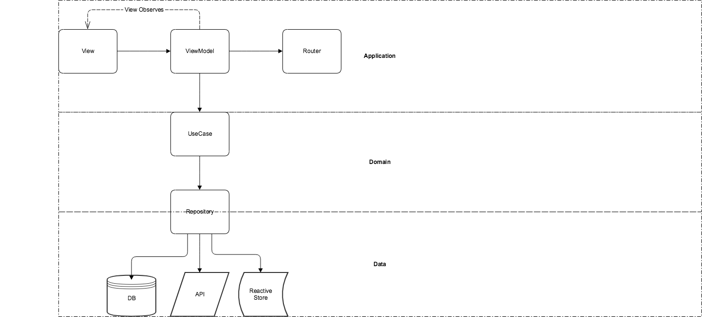

# CLEAN ARCHITECTURE

La siguiente imagen muestra la dependendencia entre las capas de clean architecture, las capas o modulos que se manejan son: presentación (presentation), dominio (domain) y datos (data). En este caso en especial se usa un nuevo modulo que es "*common*", este contiene dependencias de las capas mencionadas y funcionalidades que son comunes en el proyecto.

**Data**
* Proveer datos de manera remota o local.

**Repository:** 
* Puente entre las capas de dominio y data.
* Responsable de conectar con las fuentes de datos puede ser remota o local.
* Responsable de manejar el mapeo de data. 

**Use case (Interactors):**
* Responsable de conectar con el repositorio y regresar la data necesaria
* Regresar un flujo esto se refiere a la logica de negocio.
* Es parte de la capa de negocio.

**ViewModel:**
* Organiza la data y maneja los estados de la vista.
* Este solo debe conectarse con los casos de uso.
* No conoce nada acerca de la vista.

**View:**
* Actualiza la vista.
* Observar los cambios del view model.

En una aplicación sencilla o en algún modulo la organización de las capas seria la siguiente:

* data
    - repositories (Este contiene la implementación del repositorio)
    - remote
        * responses
        * services
    - local
        * entities
        * migrations
        * daos
        * Converters.kt
        * Database.kt
* domain
    - interactors
    - model
    - repositories (Este pertenece a logica de negocio, que solo es la interface)
* view
    - home
        * HomeFragment.kt
        * HomeViewModel.kt

En mi percepción como desarrollador de Android creo que es mejor tener el fragmento y el view model en el mismo nivel de carpeta.

Lo siguiente, sería saber que pasa con **app**, este solo sería responsable de la inyección de dependencias y tener como dependencias todas las demas capas en caso de que estas sean divididas por modulo.

## Puntos importantes

DiffUtil: Esta utilidad sirve para mejorar el performance de un RecyclerView.
Delegates: Estos sirven para obtener un valor, nos permiten hacer oneliners de algo en especifico.
SafeApiRequest: Clase para hacer peticiones seguras, estas nos permiten identificar si hay un error o fue satisfactoria la llamada.
Resource: Es una clase sellada que nos servirá para realizar un ViewStrategy esto se refiere en actualizar la vista segun el estado en el que se encuentre.
Navigation Extensions: clase para no recargar las vistas al dar clic a un elemento del bottom nav.
